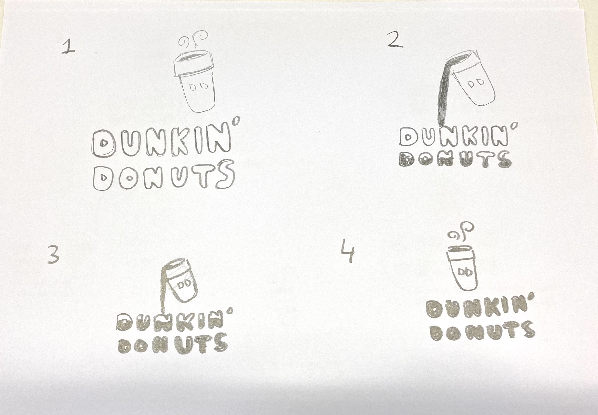
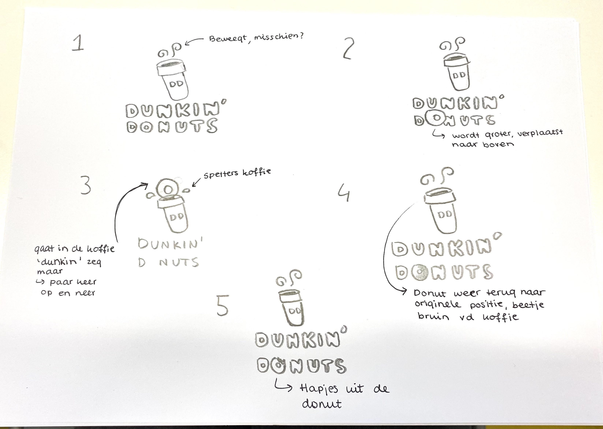
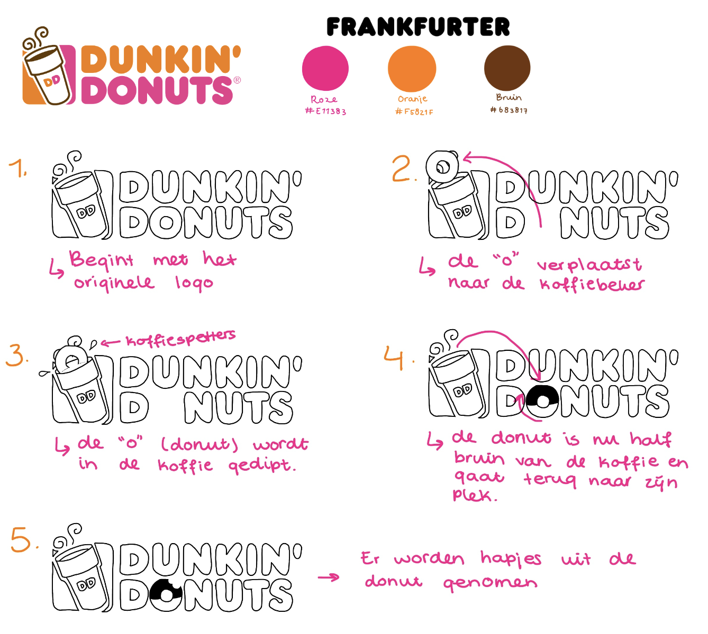
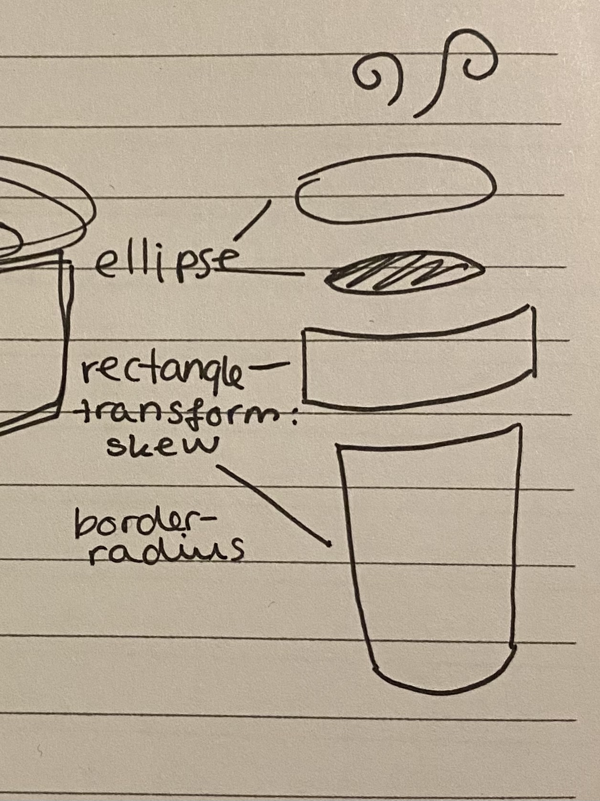
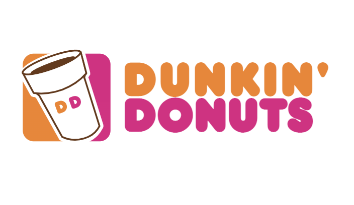
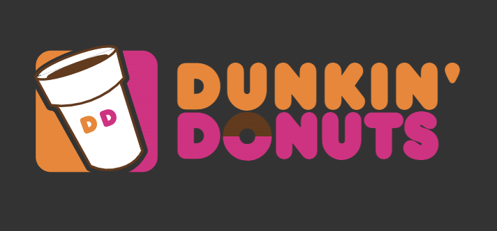
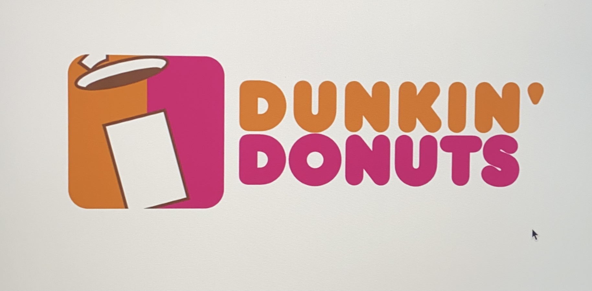
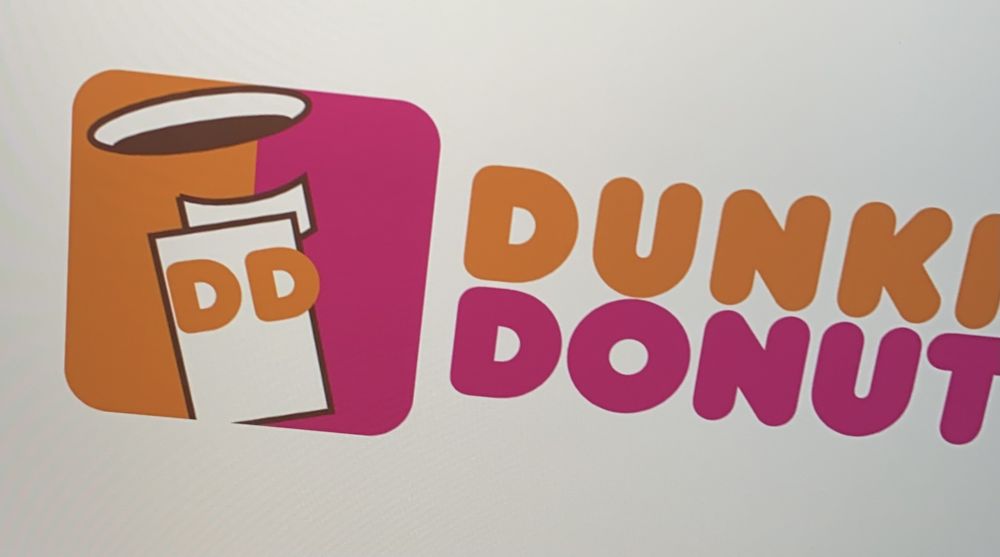

# Procesverslag
**Auteur:** Jinke Mooy

**De opdrachten:** [opdracht 1](opdracht1/index.html) en [opdracht 2](opdracht2/index.html)

Markdown is een simpele manier om HTML te schrijven.  
Markdown cheat cheet: [Hulp bij het schrijven van Markdown](https://github.com/adam-p/markdown-here/wiki/Markdown-Cheatsheet).

Nb. De standaardstructuur en de spartaanse opmaak van de README.md zijn helemaal prima. Het gaat om de inhoud van je procesverslag. Besteedt de tijd voor pracht en praal aan je website.

Nb. Door *open* toe te voegen aan een *details* element kun je deze standaard open zetten. Fijn om dat steeds voor de relevante stuk(ken) te doen.

## Bronnenlijst
  1. https://stringfixer.com/nl/Dunkin%27_Donuts (het logo)
  2. https://www.educative.io/edpresso/how-to-add-a-line-break-using-css (voor code om "Donuts" op de volgende regel te krijgen)
  3. https://stackoverflow.com/questions/7825509/css3-chain-animations (zodat de animatie goed verloopt)
  4. https://cssgradient.io/blog/css-gradient-text/ (Gebruikt voor het roze en bruine van de donut)

## Opdracht 1 plan

  
uitwerken na schetsen idee (voor week 2)

  Tijdens deze les hebben we een logo gekozen en schetsen voor de animatie gemaakt. Ik heb het Dunkin' Donuts logo gekozen. Hieronder zijn mijn schetsen te zien.

  Voor deze eerste schets heb ik een animatie bedacht waarin de beker koffie kantelt en de koffie eruit giet, waardoor de letters van het logo worden ingevuld.

  Voor de tweede schets heb ik de 'o' die op een donut lijkt uitvergroot en in de beker koffie gedipt. Hierna gaat hij weer terug naar zijn plek en wordt er een hapje uit genomen.

Ik heb besloten om de tweede schets uit te werken voor deze opdracht, omdat ik denk dat deze animatie beter past bij het merk zelf, de donut wordt namelijk letterlijk in de koffie gedunkt, en dat is wel geinig denk ik.

  ### Je storyboard:
  

  ### Je ambitie: 
  Aan deze technieken/punten wil ik werken:
  - Ik wil meer leren over SVG's en paths, ik heb daar vorig blok kort mee gewerkt, maar nog niet echt zelf vormen gemaakt.
  - Ik wil ook meer leren over animeren met CSS, de oefeningetjes van de eerste les vond ik al erg leerzaam.
  
  Een klein plan voor het icoon van het logo:
  
  
 

## Opdracht 1 reflectie

  ### Je uitkomst - karakteristiek screenshot(s):
  

  ### Dit ging goed/Heb ik geleerd: 
  - De media query's gingen goed, het was gelukt om het logo responsive te maken, de dark/light mode en de verminderde beweging setting.
  - Ik heb veel geleerd over SVG's, hoe je deze maakt en positioneert met CSS.
  - Ik heb een beetje geleerd over verschillende animatie attributen zoals animation-timing-function en animation-fill-mode.

  ### Dit was lastig/Is niet gelukt:
  - Ik vond het icoon van het logo mega lastig, ik ben daar het meeste van de tijd mee bezig geweest, waardoor ik minder tijd over had voor de animatie. Dat vind ik heel jammer, want ik had graag nog wat meer met de animatie willen doen. Hij is bijvoorbeeld nu nog best wel statisch en beweegt niet helemaal leuk zoals ik zou willen. En de hapjes eruit is ook niet meer gelukt uiteindelijk.
  - De paths begreep ik niet goed, ik had veel op internet gezocht hoe je een bepaalde vorm maakt met een path en ik denk dat je een soort wiskunde ervoor moet gebruiken, maar ik snapte het niet echt. Ik heb hiervoor hulp moeten inschakelen uiteindelijk.
  - Ik heb de 'stoom' die van de koffiebeker afkomt niet gemaakt. Ik durfde niet meer met paths te werken.
  
  Korte omschrijving met plaatje(s)

  
  Hier heb ik geprobeerd een path te maken van de vorm van de bovenkant van de koffiebeker.
  
  Hier heb ik het nog eens geprobeerd.

## Opdracht 2 plan

  
uitwerken na schetsen idee (voor week 4)

  ### Je ontwerp:
  

  ### Je ambitie: 
  Aan deze technieken/punten wil ik werken:
  - punt 1
  - punt 2
  - nog een punt
  - ...

## Opdracht 2 test

  
uitwerken na testen (week 6/7)

  Neem minimaal 5 bevindingen op:

  ### Bevinding 1:
  Omschrijving van wat er nog niet orde was (tekst en afbeeding(en)).

  #### oplossing:
  Beschrijving hoe je het hebt hebt opgelost of als het niet gelukt is hoe je het zou oplossen (tekst en afbeeding(en)).

  ### Bevinding 2:
  Omschrijving van wat er nog niet orde was (tekst en afbeeding(en)).

  #### oplossing:
  Beschrijving hoe je het hebt hebt opgelost of als het niet gelukt is hoe je het zou oplossen (tekst en afbeeding(en)).

  ### Bevinding 3:
  ...

## Opdracht 2 reflectie

  
uitwerken bij afronden opdracht (voor week 8)

  ### Je uitkomst - karakteristiek screenshot(s):
  

  ### Dit ging goed/Heb ik geleerd: 
  Korte omschrijving met plaatje(s)

  

  ### Dit was lastig/Is niet gelukt:
  Korte omschrijving met plaatje(s)

  

